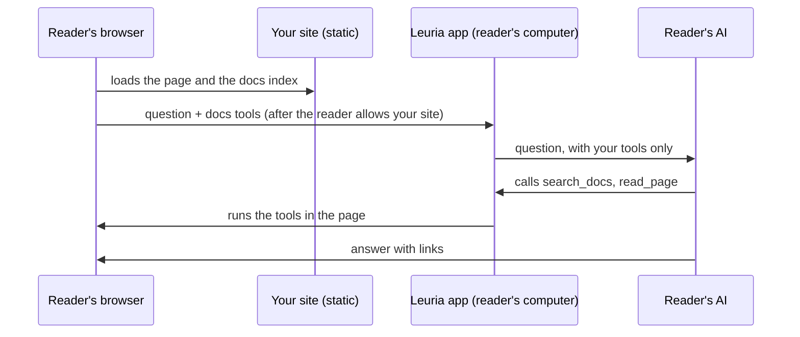

Add one plugin to your Docusaurus config and your docs get an **Ask AI** button. The assistant searches your pages, reads the ones it needs and answers with links to them. It runs on each reader's own AI (ChatGPT, Claude, or a model in Ollama or LM Studio), so you hold no API key and pay nothing per question.

<!-- truncate -->

**In short:** `npm install @leuria/docusaurus`, add `"@leuria/docusaurus"` to `plugins`, run your site. That's the whole setup. The rest of this tutorial shows what readers see, the options worth turning on, and how to add a fallback for readers who have no AI of their own.

You can try the result on this page: the **Ask AI** button at the top answers from the Leuria docs.

## What you need

- A Docusaurus 3 site (3.6 or later).
- Five minutes.
- To try it with your own AI: the [Leuria app](https://leuria.eu/download) (Mac or Windows), or `npx @leuria/cli` in a terminal.

## Step 1: install the plugin

```sh
npm install @leuria/docusaurus
```

## Step 2: add it to your config

```js title="docusaurus.config.js"
export default {
  // ...
  plugins: [
    [
      "@leuria/docusaurus",
      {
        suggestions: ["How do I get started?", "How do I deploy?"],
      },
    ],
  ],
}
```

`suggestions` are the questions the panel offers before the first one. Write the two or three questions your readers ask most.

## Step 3: run your site

```sh
npm start
```

The navbar now has an **Ask AI** button. At build time the plugin read the Markdown of every docs page (drafts and unlisted pages left out) and cut it into sections. Readers fetch that file the first time they ask.

## Step 4: ask with your own AI

1. Open the Leuria app. The first time, it asks which AI to use: an app you already pay for (ChatGPT, Claude), a model on your computer (LM Studio, Ollama), or an AI service with a key.
2. On your site, click **Ask AI**, then **Connect your AI**.
3. Allow your site in the window Leuria opens.

Ask a question. The assistant calls the docs tools (`search_docs`, `read_page`, `list_pages`, `open_page`), reads the pages it needs, and answers with links. It knows which page the reader has open and the text they selected. The conversation stays open while the reader moves between pages.

## Step 5: turn on the options worth having

```js title="docusaurus.config.js"
plugins: [
  [
    "@leuria/docusaurus",
    {
      app: "Acme docs",          // the name readers see when they connect your site
      suggestions: ["How do I get started?"],
      search: true,              // a ⌘K search, by words and by meaning (for sites without one)
      connectButton: true,       // "Connect your AI" in the navbar
      pageEmbeddings: true,      // search by meaning for readers whose AI can't embed (npm install @leuria/web-embed)
    },
  ],
],
```

- **Already on Algolia DocSearch or a local search plugin?** Leave `search` off. The plugin replaces no theme component, so it works next to your search.
- **`pageEmbeddings`** downloads a small embedding model (about 40 MB) only when the reader agrees.
- **Versioned docs** work as they are: the assistant stays in the version the reader is on.

Every option is in the [plugin reference](/docs/developers/docusaurus#options).

## Step 6 (optional): a fallback for readers with no AI

Readers without Leuria are offered it first. Below, in small, they can pick another AI for the page:

- **The browser's built-in model**, where there is one (Chrome with its AI features on). It can't use tools, so the panel searches your docs itself and gives the model the best passages.
- **Your own server**, if you set `server`. It must speak the OpenAI Chat Completions API, and add the API key on the server side:

```js
["@leuria/docusaurus", {
  server: { url: "https://ai.example.com/v1/chat/completions", model: "docs-fallback", label: "Acme's AI" },
}]
```

Everything in `server` reaches the page, so never put a key there. The [LiteLLM tutorial](/tutorials/litellm-docs-fallback) builds that endpoint, with a budget and a rate limit.

## Step 7 (optional): llms.txt for coding agents

The Ask panel serves people. Coding agents (Cursor, Claude Code, Codex) read your docs better as Markdown. Add [`docusaurus-plugin-llms`](https://github.com/rachfop/docusaurus-plugin-llms) next to it:

```sh
npm install docusaurus-plugin-llms
```

```js
plugins: [
  ["@leuria/docusaurus", { suggestions: ["How do I get started?"] }],
  ["docusaurus-plugin-llms", { generateMarkdownFiles: true }],
],
```

It writes `/llms.txt`, `/llms-full.txt` and a Markdown copy of every page at build time. This site does the same: see [leuria.dev/llms.txt](https://leuria.dev/llms.txt).

The docs tools also go to the agents built into the browser, through [WebMCP](/docs/developers/guides/tools#webmcp-the-same-tools-for-the-browsers-agents). That's on by default (`webmcp: true`).

## How it works



- Your site stays static. There is no server of yours in the loop, unless you set `server`.
- The docs index stays in the reader's browser.
- The reader's AI only gets your docs tools. Through Leuria it runs with its own tools switched off, in an empty folder.

## Hosted Ask AI or the reader's own AI?

A hosted docs assistant answers with an API key the site pays for, so every question costs you something. With Leuria, the reader's AI answers: a ChatGPT or Claude plan they already pay for, or a model on their own computer that costs nobody anything. You can still keep a hosted model as the last resort with `server`.

## FAQ

**Does it work for readers who don't have Leuria?**
Yes. They're offered Leuria first, and can pick the browser's built-in model or your `server` instead, for the page.

**Which AIs can readers use?**
ChatGPT (through Codex), Claude (through Claude Code), any model in LM Studio or Ollama, and any OpenAI-compatible API they have a key for.

**Does my content go to a third party?**
Only to the AI the reader chose. Questions never reach your server unless you set `server` and nothing else can answer.

**Does it replace my search?**
No. It sits next to Algolia DocSearch or a local search. Turn on `search: true` only if your site has none.

**Do I need to change my Markdown?**
No. The plugin reads your docs as they are.

**What does it cost?**
Nothing per question. The plugin is open source (Apache-2.0).

## Next

- [Use Ollama in a web app, without CORS or API keys](/tutorials/ollama-web-app): the reader side, with a model on their computer.
- [LiteLLM as your docs assistant's fallback](/tutorials/litellm-docs-fallback): the server side.
- [Plugin reference](/docs/developers/docusaurus): every option.

*Written for `@leuria/docusaurus` 0.1.2 and Docusaurus 3.10.*
