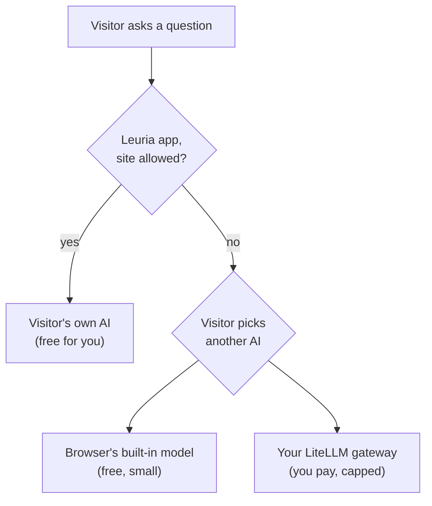

Leuria lets your site's AI features run on each visitor's own AI. Some visitors have none. For them, you can keep a model of your own as the last resort: a LiteLLM gateway, with the API key on your server, a monthly budget and a rate limit. This tutorial sets it up for a static site (Docusaurus on GitHub Pages, say) in about 20 minutes.

<!-- truncate -->

**In short:** run LiteLLM with one model alias and a virtual key capped by budget and rate. Put a tiny proxy in front that adds the key and allows only your site. Point `server()` (or the Docusaurus plugin's `server` option) at the proxy, with `model` set.

## The cascade



Your gateway answers only when the visitor has no AI of their own and picks yours. So the bill stays small, and the cap keeps it that way.

## What you need

- A server that can run Docker, reachable over HTTPS (any small VPS).
- An API key for a model provider (OpenAI, Anthropic, Mistral…), or your own vLLM or Ollama server.
- A free Cloudflare account for the proxy, or any place that runs a small function.

## Step 1: run LiteLLM with one model alias

Expose one alias, `docs-fallback`, so you can swap the model behind it without touching your site.

```yaml title="litellm_config.yaml"
model_list:
  - model_name: docs-fallback
    litellm_params:
      model: mistral/mistral-small-latest # or openai/…, anthropic/…, hosted_vllm/…
      api_key: os.environ/MISTRAL_API_KEY

general_settings:
  master_key: os.environ/LITELLM_MASTER_KEY
  database_url: os.environ/DATABASE_URL # virtual keys and budgets need a database
```

```yaml title="docker-compose.yml"
services:
  litellm:
    image: docker.litellm.ai/berriai/litellm:latest
    command: ["--config", "/app/config.yaml"]
    volumes: ["./litellm_config.yaml:/app/config.yaml:ro"]
    ports: ["4000:4000"]
    environment:
      MISTRAL_API_KEY: ${MISTRAL_API_KEY}
      LITELLM_MASTER_KEY: ${LITELLM_MASTER_KEY}
      DATABASE_URL: postgresql://litellm:litellm@db:5432/litellm
    depends_on: [db]
  db:
    image: postgres:16
    environment:
      POSTGRES_USER: litellm
      POSTGRES_PASSWORD: litellm
      POSTGRES_DB: litellm
    volumes: ["pgdata:/var/lib/postgresql/data"]
volumes:
  pgdata:
```

```sh
export MISTRAL_API_KEY=... LITELLM_MASTER_KEY=sk-$(openssl rand -hex 16)
docker compose up -d
```

Put LiteLLM behind HTTPS (Caddy, nginx, or your host's load balancer).

## Step 2: create a capped key for your site

The master key never leaves your server. Make a virtual key that can only use `docs-fallback`, with a budget and a rate limit:

```sh
curl -X POST https://llm.example.com/key/generate \
  -H "Authorization: Bearer $LITELLM_MASTER_KEY" \
  -H "Content-Type: application/json" \
  -d '{
    "key_alias": "docs-fallback",
    "models": ["docs-fallback"],
    "max_budget": 10,
    "budget_duration": "30d",
    "rpm_limit": 30
  }'
```

That's $10 a month (LiteLLM counts in US dollars) and 30 requests a minute, at most. When the budget is spent, the gateway refuses, and readers are offered Leuria and the browser's model as before.

## Step 3: a proxy that adds the key

Everything you give `server()` reaches the page, so the key can't go there. A Cloudflare Worker sits between the page and LiteLLM. It allows only your site's origin, forces the model and caps the answer's length:

```js title="worker.js"
export default {
  async fetch(request, env) {
    const cors = {
      "Access-Control-Allow-Origin": env.SITE_ORIGIN,
      "Access-Control-Allow-Methods": "POST, OPTIONS",
      "Access-Control-Allow-Headers": "Content-Type",
      Vary: "Origin",
    }
    const allowed = request.headers.get("Origin") === env.SITE_ORIGIN
    if (request.method === "OPTIONS") return new Response(null, { status: allowed ? 204 : 403, headers: cors })
    if (request.method !== "POST" || !allowed) return new Response("Forbidden", { status: 403 })

    const body = await request.json()
    body.model = "docs-fallback"
    body.max_tokens = Math.min(body.max_tokens ?? 1024, 1024)

    const upstream = await fetch(`${env.LITELLM_URL}/v1/chat/completions`, {
      method: "POST",
      headers: { "Content-Type": "application/json", Authorization: `Bearer ${env.LITELLM_KEY}` },
      body: JSON.stringify(body),
    })
    return new Response(upstream.body, {
      status: upstream.status,
      headers: { ...cors, "Content-Type": upstream.headers.get("Content-Type") ?? "text/event-stream" },
    })
  },
}
```

```sh
npx wrangler deploy worker.js --name docs-ai
npx wrangler secret put LITELLM_KEY        # the virtual key from step 2
npx wrangler secret put LITELLM_URL        # https://llm.example.com
npx wrangler secret put SITE_ORIGIN        # https://docs.example.com
```

The origin check stops other websites from using your gateway from their pages. It doesn't stop a script that fakes the header: the budget and the rate limit on the key do.

## Step 4: point your site at it

**Docusaurus**, with the [Ask AI plugin](/tutorials/docusaurus-ask-ai):

```js title="docusaurus.config.js"
plugins: [
  [
    "@leuria/docusaurus",
    {
      suggestions: ["How do I get started?"],
      server: {
        url: "https://docs-ai.<you>.workers.dev",
        model: "docs-fallback",
        label: "Acme's AI",
      },
    },
  ],
],
```

**Any other site**, with the SDK:

```ts
import { createAI, leuria, promptAPI, server } from "@leuria/client"

const ai = createAI({
  providers: [
    leuria({ app: "Acme docs" }),                       // the visitor's own AI first
    promptAPI(),                                         // the browser's built-in model
    server({ url: "https://docs-ai.<you>.workers.dev", model: "docs-fallback", label: "Acme's AI" }),
  ],
})
```

Set `model`: LiteLLM doesn't pick one for you. (`@leuria/docusaurus` sends it from 0.1.2.)

## Step 5: try it

1. Open your site in a browser without Leuria.
2. Click **Ask AI**. The panel proposes Leuria first.
3. Pick **Acme's AI** below. Ask a question.

Each request shows up in LiteLLM's spend logs under the `docs-fallback` key.

To make your gateway answer at once for readers without Leuria, instead of after they pick it, set `fallback: "auto"`.

## Options worth knowing

- **Tools.** The docs tools (`search_docs`, `read_page`) still run in the page: your gateway only relays the model's tool calls. Choose a model that calls tools well. If yours can't, set `tools: false`.
- **Structured output.** If your model supports `response_format: { type: "json_schema" }`, set `jsonSchema: true`.
- **Images.** Set `images: true` if the model reads images.

## The same with vLLM, Ollama or oMLX on your server

Anything that speaks the OpenAI Chat Completions API with streaming works behind the proxy:

- **vLLM**: `vllm serve <model> --served-model-name docs-fallback --enable-auto-tool-choice --tool-call-parser <parser>`, then add it to LiteLLM's `model_list` with `model: hosted_vllm/docs-fallback` and `api_base: http://<vllm-host>:8000/v1`.
- **Ollama or oMLX** on a server: same, with their `/v1` address. Keep them behind the proxy too: neither should face the internet without a key.

Going through LiteLLM keeps the budget, the rate limit and the spend logs in one place.

## FAQ

**Why not call LiteLLM straight from the page with the virtual key?**
The key would be in your site's JavaScript, for anyone to copy and use anywhere. The proxy keeps it on the server.

**Does my gateway see questions from visitors who use their own AI?**
No. Those go from the page to Leuria on the visitor's computer, then to their AI.

**What happens when the budget runs out?**
The gateway refuses. Readers can still connect their own AI or use the browser's model.

**Can I use OpenRouter instead of LiteLLM?**
Yes. The proxy is the same: put your OpenRouter key in the Worker and pick the model there.

## Next

- [Use Ollama in a web app, without CORS or API keys](/tutorials/ollama-web-app): the visitor's side.
- [Going to production](/docs/developers/production): limits, privacy, Content-Security-Policy.

*Written for `@leuria/docusaurus` 0.1.2, `@leuria/client` 0.1.4 and LiteLLM's `latest` image.*
