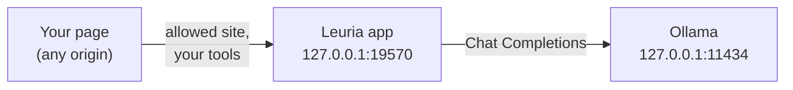

Your visitors already run models in Ollama. With Leuria, your website can use them: the visitor's own Ollama model answers on your site, with your page's tools, and you pay nothing per request. Nobody touches `OLLAMA_ORIGINS`, opens a port or pastes a key.

<!-- truncate -->

**In short:** add Leuria to your page (one script from a CDN). A visitor with Ollama installs the Leuria app, picks an Ollama model, and allows your site once. From then on, your AI features run on their model, on their computer.

## Why not call Ollama from the page?

The usual way is to `fetch("http://localhost:11434/api/chat")` from the browser. That breaks for real visitors:

- **CORS.** Ollama refuses browser requests from origins it doesn't know. Each visitor would have to set `OLLAMA_ORIGINS` for your site and restart Ollama.
- **No consent.** Any page the visitor opens could use their model the same way.
- **One AI only.** Visitors who use ChatGPT, Claude or LM Studio instead get nothing.

With Leuria, the browser never calls Ollama. The Leuria app, on the visitor's computer, does. It answers only the sites the visitor allowed, and gives the model only the tools your page offers.



## Part 1, for site builders: add Leuria to your page

One file, no build step:

```html title="index.html"
<!doctype html>
<leuria-connect-button></leuria-connect-button>
<p><input id="question" placeholder="Ask something"> <button id="ask">Ask</button></p>
<p id="answer"></p>

<script type="module">
  import { leuria, promptAPI, createAI, setDefaultClient } from "https://cdn.jsdelivr.net/npm/@leuria/connect/dist/standalone.js"

  // The visitor's own AI first (their Ollama model, or another AI they chose), then the browser's built-in model.
  const ai = createAI({
    providers: [leuria({ app: "My site", needs: { effort: "light" } }), promptAPI()],
  })
  setDefaultClient(ai)

  document.querySelector("#ask").onclick = async () => {
    const answer = document.querySelector("#answer")
    answer.textContent = ""
    for await (const event of ai.chat({ prompt: document.querySelector("#question").value })) {
      if (event.type === "text-delta") answer.textContent += event.text
    }
  }
</script>
```

`<leuria-connect-button>` handles the whole connect flow. `needs` tells Leuria what your feature needs, so it recommends the smallest of the visitor's models that is enough: a short answer doesn't need a 70B model.

On Docusaurus, the [Ask AI plugin](/tutorials/docusaurus-ask-ai) does all this for you.

### Give the model tools

Ollama models trained for tool calling (Qwen 3, Llama 3.1, gpt-oss…) can call functions in your page:

```js
const listMugs = {
  name: "list_mugs",
  description: "List the mugs for sale, with their price in euros.",
  inputSchema: { type: "object", properties: {} },
  execute: () => [{ name: "Celadon", price: 24 }, { name: "Tenmoku", price: 31 }],
}

const answer = await ai.chat({ prompt: "Which mug is cheapest?", tools: [listMugs] }).text()
```

The tool runs in the page. The model only sees what it returns. Declare `needs: { tools: true }` so Leuria recommends a model that can call tools. See [Page tools](/docs/developers/guides/tools).

## Part 2, for Ollama users: let your model answer on websites

### 1. Pull a chat model

```sh
ollama pull qwen3:8b
```

Any chat model works. For sites with tools (Ask AI on docs, shops), pick one trained for tool calling. 4B to 8B models handle light tasks well.

### 2. Install Leuria

Download it from [leuria.eu/download](https://leuria.eu/download) (Mac and Windows), or with Homebrew:

```sh
brew tap leur-ia/leuria https://github.com/leur-ia/leuria
brew install --cask leuria
```

On Linux, run the engine from a terminal: `npx @leuria/cli@latest`.

### 3. Choose your Ollama model

Open Leuria. Under **Add an AI**, choose **A model on this computer**. Leuria finds Ollama at its usual address and lists your models. Pick one. You can change it later, for every site or for one site.

If Ollama isn't listed, make sure it runs (the Ollama app is open, or `ollama serve`), then click **Look again**.

### 4. Allow a site

On a site that uses Leuria (try [demo.leuria.dev](https://demo.leuria.dev)), click **Connect your AI** and allow the site in Leuria's window. Its AI features now run on your model.

## Search by meaning: add an embedding model

Sites that search by meaning (the Docusaurus plugin's search, for one) use an embedding model on your computer when you have one:

```sh
ollama pull nomic-embed-text
```

Leuria finds it on its own. Embeddings only ever use a model on your computer, never a service on the network.

## Ollama cloud models

Ollama also lists the cloud models you signed in to, which run on ollama.com. Leuria shows them, but doesn't count them as on this computer when it recommends a model.

## Troubleshooting

**Leuria says "No model found on this computer".**
Ollama isn't running, or has no chat model yet. Start Ollama, run `ollama list` to check, then click **Look again**.

**Do I need `OLLAMA_ORIGINS` or `OLLAMA_HOST`?**
No. The browser never calls Ollama. Leuria calls it from the same computer, at `127.0.0.1:11434`.

**Ollama runs on another port or machine.**
Add it as a service with its address: in Leuria, **Add an AI** → **An AI service with a key** → **Another service**, address `http://<host>:<port>/v1`. Or from a terminal: `npx @leuria/cli providers add "My Ollama" http://<host>:<port>/v1`.

**Answers say the model can't use the site's tools.**
Pick a model trained for tool calling, such as `qwen3:8b`.

## FAQ

**Does my data leave my computer?**
With an Ollama model on your computer, no: the site's page sends the question to Leuria, Leuria to Ollama, both on your computer.

**Can a website use my model without asking?**
No. A site must ask, and you allow it in Leuria's own window. You can disconnect it at any time.

**What does it cost the website?**
Nothing. The visitor's model answers.

## Next

- [LiteLLM as your docs assistant's fallback](/tutorials/litellm-docs-fallback): for visitors with no AI of their own.
- [Use LM Studio models on any website](/tutorials/lm-studio-websites).
- [Providers and the cascade](/docs/developers/guides/providers): who answers, and when.

*Written for Leuria 0.1.4 and `@leuria/client` 0.1.4.*
