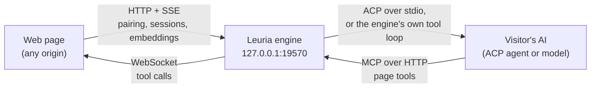
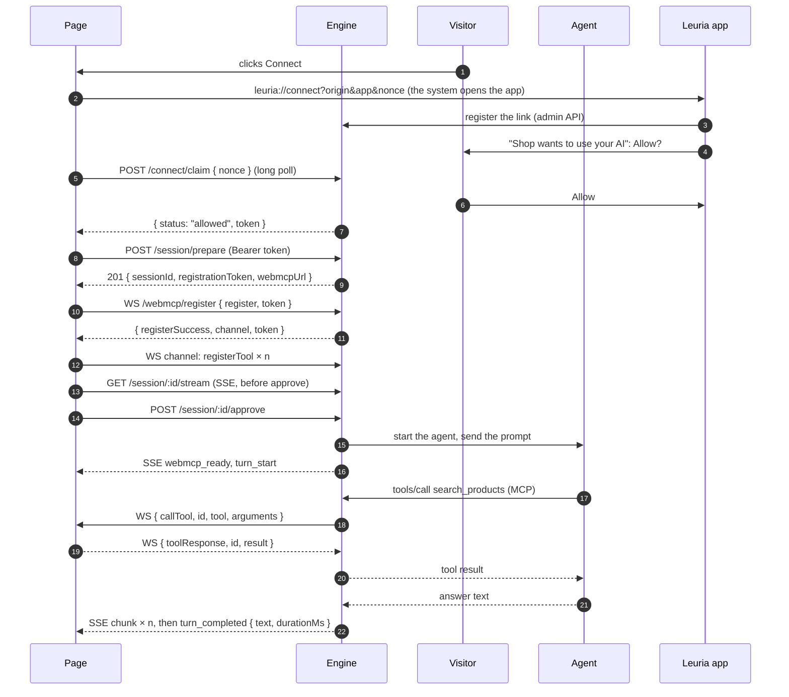
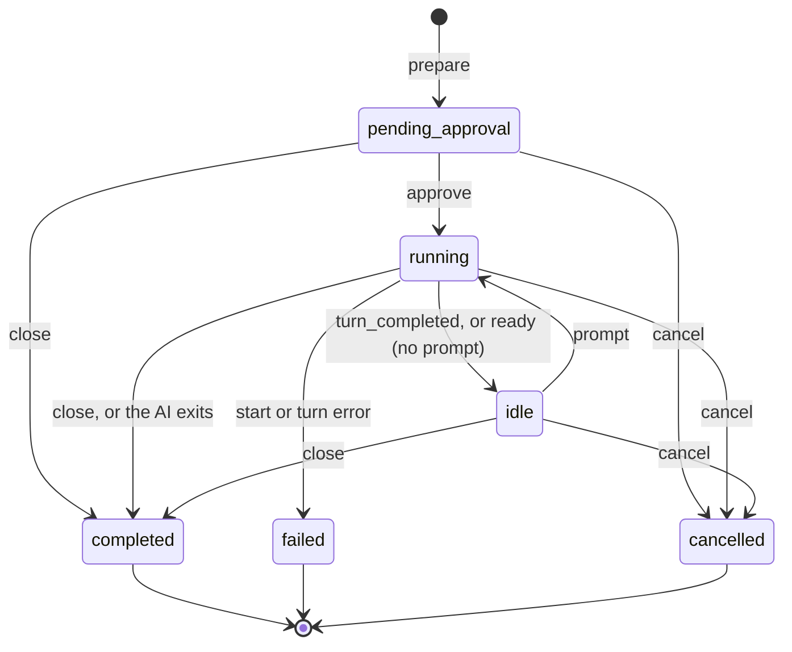

# Leuria engine protocol

**Version 0.2, draft.** This page specifies how a web page talks to the Leuria engine on the visitor's computer. [`@leuria/client`](sdk.md) implements it, so you only need this page to write another client, or to check what goes over the wire.

## Status and versioning

- The protocol is a draft and may change before 1.0. Nothing here is frozen yet.
- It has no version number of its own. A client learns the engine's version from the `leuria` field of [`GET /health`](#health). Today that is the engine package's version, for example `0.1.0`.
- A 0.x engine may add fields to responses and events. Clients should ignore fields and events they don't know.
- When this page and the engine disagree, the engine is right. Please report it.
- **0.2** changes pairing: the engine stays silent to pages it doesn't know, a page asks through a `leuria://connect` link, and collects its token with `POST /connect/claim`. `POST /connect` and `/connect/:id/wait` are gone.

## Overview

The engine runs on the visitor's machine and listens on the loopback interface. Pages reach it over HTTP, server-sent events (SSE) and a WebSocket. Towards agents, the engine speaks [ACP](https://agentclientprotocol.com) v1, the stable version, and MCP. A page never talks to the agent directly.



A whole exchange, from a page that has never connected to a turn with one tool call:



## Conventions

**Base URL.** `http://127.0.0.1:19570` by default. The visitor can change the port with `leuria --port`, the `LEURIA_PORT` variable or `~/.leuria/config.json`. The engine binds to `127.0.0.1` only.

**Host.** Every request must carry `Host: 127.0.0.1:<port>` or `Host: localhost:<port>`. This blocks DNS rebinding. Any other host gets `403 { "error": "host not allowed" }`.

**Callers.** The engine tells callers apart by the `Origin` header:

| Caller | Recognized by | May use |
| --- | --- | --- |
| Web page | An `http:` or `https:` `Origin` | Nothing, until the visitor connects it or a link names it (see [Silence](#silence)). Then `POST /connect/claim`, and everything else with its grant token |
| Engine's own page | `Origin: http://127.0.0.1:<port>` or `http://localhost:<port>` | `/health` and `/connect/*` (the CLI's approval page). Anything else is `403` |
| The desktop app | Its webview's origin (`tauri://localhost`, `http(s)://tauri.localhost`) and the admin token | The admin API under `/admin/`, which also registers `leuria://connect` links |
| Local process (CLI, agent, curl) | No `Origin` | Everything. It already runs as the visitor |

An `Origin` that is not `http:` or `https:` gets `403 { "error": "origin not allowed" }`. Origins are compared in their normalized form: scheme, host and port, lower case.

**Authentication.** A page sends its grant token as `Authorization: Bearer <token>`. A page without a valid token gets `401 { "error": "…", "code": "not_paired" }` on every route that needs one.

<a id="silence"></a>**Silence.** The desktop app's engine answers no page it doesn't know, so a site can't tell that Leuria is installed. A web origin gets an empty `403` with no CORS headers (the browser then fails the request, exactly as when nothing listens), unless:
- the visitor connected it (it has a grant), or
- a `leuria://connect` link named it and the answer hasn't been collected yet.

This covers every route, `/health` and preflight requests included. The CLI engine (`npx @leuria/cli`, for developers) answers every origin: it can't receive links.

**CORS.** For web origins it answers, the engine echoes `Access-Control-Allow-Origin: <origin>`, with `Vary: Origin` and `Access-Control-Allow-Private-Network: true`. Preflight requests (`OPTIONS`) get `204` with:
- `Access-Control-Allow-Methods: GET, POST, OPTIONS`
- `Access-Control-Allow-Headers: Content-Type, Authorization`
- `Access-Control-Max-Age: 600`

**Bodies.** Requests and responses are JSON (`Content-Type: application/json`). An empty request body counts as `{}`. Bodies may be up to 16 MB. Invalid JSON gets `400 { "error": "Invalid JSON body" }`.

**Errors.** Every error is `{ "error": string, "code"?: string }`. Show `error` in logs, not to visitors. Branch on the HTTP status and `code`:

| Status | `code` | When |
| --- | --- | --- |
| `400` | | Malformed request, or an action the session's state doesn't allow (the message says which) |
| `401` | `not_paired` | The page has no valid grant token. Forget the token and offer to connect again |
| `403` | | Wrong `Host` or `Origin`, or a route this caller may not use |
| `404` | | Unknown route, unknown pairing request, or a session this origin doesn't own |
| `410` | | The pairing request expired before the visitor decided |
| `429` | | Too many pending pairing requests (20), or the visitor said no to this site less than 30 s ago |
| `502` | | The local embedding service failed |
| `503` | `no_embedder` | No local embedding model is available |
| `500` | | Unexpected engine error |

## Health

`GET /health`. A connected page sends its token; local callers need none. With the desktop app, a page it doesn't know gets no answer (see [Silence](#silence)), so a page with no token has nothing to ask: it learns whether Leuria is there by connecting.

```json
{ "leuria": "0.1.0", "ok": true, "agent": "Claude · Sonnet 5", "approvals": "app", "paired": true, "embed": "text-embedding-nomic-embed-text-v1.5" }
```

| Field | Meaning |
| --- | --- |
| `leuria` | Engine version. Its presence means "this is Leuria" |
| `ok` | Always `true` when the engine answers |
| `agent` | A plain name for the AI. A connected page gets its own AI and model; everyone else gets the visitor's default AI |
| `approvals` | Where the visitor answers pairing requests: `app` (the desktop app's own window) or `page` (the CLI's approval page, which the engine opens in the browser). Informational: the pairing flow is the same |
| `paired` | Web pages only: `true` when the bearer token sent with this request is valid |
| `embed` | The embedding model a connected page would get (see [Embeddings](#embeddings)). Absent for pages that aren't connected, and when there is no model |

## Pairing

Pairing gives a page a grant: a token that works only for its origin. It starts from the visitor's click, never from a request the page makes on its own.

| Step | Who | What |
| --- | --- | --- |
| 1. Link | The page, in the click handler | Make a secret `nonce` (16 to 96 random bytes, base64url), then open `leuria://connect?origin=<page origin>&app=<name>&nonce=<nonce>`, plus the site's needs if it declares them (`&tools=1&images=1&effort=light&context=8000`) and one `&skill=<ref>` per skill it uses. The system hands the link to the Leuria app, and starts it if needed |
| 2. Ask | The app | Registers the link with the engine (`POST /admin/pairing/link { origin, app?, nonce, needs?, skills? }`, admin token) and asks the visitor in its own window. From now on, the engine answers this origin |
| 3. Claim | The page | `POST /connect/claim { nonce, app?, needs?, skills? }`, long-polled for up to 25 s; call it again after `pending` |
| 4. Answer | The engine | `200 { status: "pending" }`, `{ status: "denied" }`, or `{ status: "allowed", token }` |

- **Before the link arrives**, the claim gets no readable answer (the engine is silent to this origin). Keep claiming for a few seconds: the app may be starting. A page that never gets an answer should say that Leuria isn't running, or isn't installed.
- **Only the linked origin, with the link's nonce**, gets the answer. The browser sets `Origin`, so a site that forges a link naming another site can't claim, and the named site doesn't know the nonce. A wrong nonce from the linked origin gets `404`.
- **Trying again** (a new link from the same origin) updates the nonce of the question already asked instead of asking twice. Only a claim with the latest nonce gets the answer; earlier ones get `404`.
- **After a No**, the same origin can't ask again for 30 seconds: its claims and links get `429`.
- The token is returned once. The request is then forgotten.
- The engine stores only the token's SHA-256, in `~/.leuria/grants.json`. Pairing again replaces the token. The site keeps its AI and model choice.
- **Needs** are a closed vocabulary: `tools` and `images` (flags), `effort` (`light`, `standard` or `deep`) and `context` (tokens). Unknown keys and values are dropped. They are guidance for the visitor's choice of AI and model, stored with the grant, and never change what the site may do.
- **Skills** are refs in the `npx skills` syntax (see the [Skills guide](guides/skills.md)): up to 16 strings of at most 300 characters. The engine fetches them while the visitor looks at the question, shows them there, and stores them with the grant.
- A request expires after 5 minutes. At most 20 can be pending at once, across all sites. `app` is cut to 80 characters.
- The visitor can revoke a grant at any time (`leuria sites revoke <origin>`, or the desktop app). This ends the origin's sessions, and its token stops working.

**The site's settings.** `leuria://site?origin=<page origin>`, opened from a click, brings the app forward on that site's settings (its AI and model). It carries no secret, changes nothing, and the app ignores it for a site that isn't connected. The engine isn't involved.

**The CLI engine** can't receive links, so the claim itself asks: a claim from an origin with no question pending creates one, and the engine opens its approval page in the visitor's browser (`GET /connect/:id`, also printed in the terminal). The page is sent with `X-Frame-Options: DENY` and a strict Content-Security-Policy, so no site can frame it. Only a click there, posted as `POST /connect/:id/decide { allow }` from the engine's own origin, decides. `GET /connect/:id/state` lets that page see an answer given elsewhere; it is reserved for the engine's own origin. The page's side of the flow doesn't change.

## Sessions

A session is one running AI for one page, with that page's tools.

| Method and path | Body | Response |
| --- | --- | --- |
| `POST /session/prepare` | `{ prompt?, attachments?, systemPrompt?, maxTurns?, skills? }` | `201 { sessionId, status: "pending_approval", registrationToken, webmcpUrl }` |
| `GET /session/:id/stream` | | Server-sent events, see [Stream events](#stream-events) |
| `POST /session/:id/approve` | | Starts the AI and sends `prompt`, if any. Without a prompt the session goes `idle` and emits `ready` (a warm start) |
| `POST /session/:id/prompt` | `{ prompt, attachments? }` | A follow-up turn on an `idle` session |
| `POST /session/:id/cancel-turn` | | Stops the current turn and keeps the session |
| `POST /session/:id/cancel` | | Ends the session: `cancelled` |
| `POST /session/:id/close` | | Ends the session: `completed` |
| `GET /session/:id` | | `{ id, status, origin, createdAt, error?, registrationToken, webmcpUrl }` |

The `POST` actions answer `200 { sessionId, status }`. An action the current status doesn't allow answers `400` with the reason. Examples: `approve` twice, or `prompt` while a turn runs or after the AI has ended.

**Rules.**
- A session is visible only to the origin that prepared it. Other origins get `404`, as if it didn't exist.
- An origin may hold 4 live sessions. The fifth `prepare` gets `400`. Close sessions you no longer need.
- The page cannot choose the AI. The visitor sets a default (`leuria --agent`, or the desktop app), and may pick another AI or model per site (`leuria sites use`). When the visitor changes a site's AI or model, the engine cancels that site's sessions, and the next session uses the new choice.
- `prompt`, when given, must be a non-empty string.
- `systemPrompt` replaces the agent's coding-assistant preset.
- `skills`, when present, is the site's current list of skill refs. When it differs from the grant's, the engine fetches it in the background for the next sessions; `[]` removes them, and leaving it out changes nothing. A session gets the grant's skills: their names and descriptions after `systemPrompt`, and a `read_skill` tool.
- `maxTurns` caps the AI's steps per turn. It is clamped between 1 and 50.
- The AI must start within 60 s, or the session fails.
- An ended session stays readable (`GET`, `stream`) for 5 minutes, then answers `404`.

**Attachments.** Up to 10 per request, each one of:
- `{ type: "image", mimeType: "image/…", data: <base64>, name? }`. Images go to the AI as image blocks when it accepts them. Otherwise they are replaced by a short note.
- `{ type: "text", text, name?, mimeType? }`. Text files are wrapped in `<file name="…">…</file>`.

**Lifecycle.**



`cancel-turn` stops the turn in progress. The session stays usable, and the next `prompt` works as usual.

## Stream events

`GET /session/:id/stream` answers `200` with `Content-Type: text/event-stream` and sends its headers at once. Each event is:

```
event: <name>
data: <JSON>

```

| Event | Data |
| --- | --- |
| `webmcp_ready` | `{ registrationToken, webmcpUrl }`. Sent on `approve`, and again on every new stream once approved |
| `ready` | `null`. The AI is up and idle. Sent after a prompt-less `approve`, and on a new stream to an `idle` session |
| `turn_start` | `null` |
| `chunk` | The AI's text, as a JSON string. A new stream replays the current turn's chunks |
| `thought` | The AI's reasoning text (string) |
| `tool_call` | `{ toolCallId, title?, kind?, status?, toolName? }`, for each call and update |
| `permission` | `{ toolName, allow }`, for each permission decision the engine's policy makes |
| `log` | A line the agent wrote to stderr (string). For debugging, never for visitors |
| `turn_completed` | `{ text, durationMs }`. `text` is the whole turn's text |
| `completed`, `cancelled` | `null`. The stream then ends |
| `failed` | An error message (string). The stream then ends |

**Replay.** A new stream to a live session first gets `webmcp_ready` (once approved), then `ready` (if idle), then the current turn's `chunk`s so far. It then follows live events. A stream opened on a session that has already ended gets its final event (`completed`, `cancelled`, or `failed` with the error) and closes.

## Page tools (WebMCP)

The page's tools run in the page. The engine relays the AI's calls to them over a WebSocket channel. Browsers can't set headers on WebSockets, so an upgrade is allowed when the page's origin has a grant. The tokens below do the rest. Upgrades from origins without a grant get `403`.

**Tokens.**
- `webmcpUrl` is `http://127.0.0.1:<port>`.
- `registrationToken` is base64 of `{ "server": "ws://127.0.0.1:<port>", "token": "<one-time token>" }`. Send it as it is: the engine accepts the whole blob, or just the inner token.

**Handshake.**

1. **Register.** Open `ws://127.0.0.1:<port>/webmcp/register` and send `{ "type": "register", "token": "<registrationToken>" }`. The reply is `{ "type": "registerSuccess", "channel": "/webmcp/channel/<id>", "token": "<channel token>" }`, or `{ "type": "error", "message" }`. The registration token works once.
2. **Open the channel** at `ws://127.0.0.1:<port><channel>?token=<channel token>`. A wrong token is refused with `401`. The channel token stays valid for the session's life, so the page can reconnect with it.
3. **Declare tools**, before or after `approve`. Tools declared on a channel stay for the session.
4. **Answer calls** until the session ends. The engine closes the channel when the session ends.

**Page → engine.**

| Message | Fields | Effect |
| --- | --- | --- |
| `registerTool` | `name`, `description?`, `inputSchema?` (default: an empty object schema), `annotations?`. Also accepted nested as `{ tool: { … } }` | Adds or replaces a tool. The engine answers `{ type: "ack", registration: "registerTool", name }` |
| `deregisterTool` | `name` | Removes a tool. Agents are not told that the list changed, so declare tools before the first turn |
| `registerResource` | `uri`, `name?`, `description?`, `mimeType?` | Adds a resource (MCP `resources/list`) |
| `registerPrompt` | `name`, `description?`, `arguments?` | Adds a prompt (MCP `prompts/list`) |
| `toolResponse` | `id`, then `result`, or `error` (a string, or `{ message }`) | Answers a `callTool` |
| `resourceResponse`, `promptResponse` | `id`, `result` or `error` | Answers `readResource` or `getPrompt` |
| `ping` | | The engine answers `{ type: "pong" }` |
| `pong` | | Answer to the engine's `ping` |

**Engine → page.**

| Message | Fields | Expects |
| --- | --- | --- |
| `callTool` | `id`, `tool`, `arguments` | `toolResponse` with the same `id` |
| `readResource` | `id`, `uri` | `resourceResponse` |
| `getPrompt` | `id`, `name`, `arguments` | `promptResponse` |
| `ping` | | `pong`. Sent every 15 s |
| `ack` | `registration`, `name` | Nothing |

```json
{ "type": "registerTool", "name": "search_products", "description": "Search products. Returns name, price and stock.", "inputSchema": { "type": "object", "properties": { "query": { "type": "string" } }, "required": ["query"] } }
{ "type": "callTool", "id": "5f0c…", "tool": "search_products", "arguments": { "query": "blue mug" } }
{ "type": "toolResponse", "id": "5f0c…", "result": [{ "name": "Celadon mug", "price": 24, "stock": 3 }] }
{ "type": "toolResponse", "id": "5f0c…", "error": "The catalog is offline." }
```

- A call may stay open for 10 minutes, for example while the visitor confirms something in the page. After that the engine gives up on it.
- A `result` that is a string reaches the AI as it is. Anything else reaches it as JSON text. An `error` reaches it as a failed tool call.
- A call that arrives while no channel is connected fails at once, so keep the channel open for the whole session.

**The AI's side.** The agent reaches the same tools at `POST /webmcp/mcp`: MCP over streamable HTTP, with `Authorization: Bearer <channel token>`, as the MCP server `webmcp`. Claude sees them as `mcp__webmcp__<name>`. Pages can't call this endpoint (`403`). Models run by the engine's own tool loop (LM Studio, Ollama, OpenAI-compatible APIs) get the same tools in-process. When the site has skills, the engine adds its own `read_skill` tool (`{ name, file? }`) to the list and answers it itself; the page never sees these calls.

## Embeddings

`POST /embed` `{ texts: string[], kind?: "query" | "document" }` returns `{ model, vectors }`: one vector per text, in order. It needs the grant token.

- `kind` defaults to `document`. Some models embed queries differently. The engine adds the prefix their model card asks for (nomic-embed, e5, bge, mxbai).
- The model is an embedding model in LM Studio or Ollama on this computer. It is the one the visitor chose, or else the first one found. Services reached over the network are never used, so a page's text never leaves the machine and never spends the visitor's API credits. The visitor can also turn embeddings off.
- At most 256 texts per request, each cut to 8,000 characters. Malformed requests get `400`.
- No local embedding model: `503 { error, code: "no_embedder" }`. The local service failed: `502`.
- Vectors from different models can't be compared. Keep `model` with them, and rebuild when it changes. `GET /health` names the current model in `embed`.

## Conformance

A client **must**:

- Talk to `127.0.0.1` (or `localhost`) on the engine's port, from a page with an `http:` or `https:` origin.
- Keep the grant token per origin and per engine URL, and send it as `Authorization: Bearer` on every request after pairing.
- Forget the token when a response is `401` with `code: "not_paired"`, or when `/health` says `paired: false`. Then offer to connect again.
- Start pairing only from a visitor's action. Open the `leuria://connect` link inside the click handler, before any `await`, with a fresh nonce for each attempt.
- Claim with `POST /connect/claim` again after each `pending`, and after each unreadable answer for a few seconds (the app may be starting), until `allowed`, `denied` or its own time limit.
- Send no request to the engine while the site has no token: it would only make the browser ask about local network access, and Leuria wouldn't answer anyway.
- Open the event stream **before** `approve`, so no event is missed.
- Register its tools before the AI can need them: before `approve`, or at least before the first prompt.
- Answer every `callTool` with a `toolResponse` carrying the same `id`, including for unknown tools (with an `error`).
- Answer the engine's `ping` with `pong`.
- Treat `completed`, `cancelled` and `failed` as the end of the session.

A client **should**:

- Once connected, check `/health` with a short timeout (`@leuria/client` uses 1.5 s), and treat no answer as "not running".
- Tell the visitor that Leuria isn't running (or isn't installed) when a claim gets no readable answer for about 10 s, and offer to try again.
- Reopen a dropped event stream with backoff, and skip the replayed `chunk`s it already has.
- Reopen a dropped tool channel with the same channel token, and declare its tools again.
- Close sessions it no longer needs (`/close`, with `keepalive` during page unload). An origin has only 4.
- Show visitors plain words, never `error` strings, event names or engine versions.

`@leuria/client` does all of this. It opens the link as a click on a link would, keeps tokens in `localStorage` under `leuria:token:<engine URL>`, or in memory where storage is blocked. It gives up after 5 reconnect attempts, spaced by 0.5 s doubling up to 8 s.

## Security considerations

- The engine trusts no website until the visitor allows it, and then only for that origin. The token is useless from any other origin, because the engine checks `Origin` on every request.
- With the desktop app, a site the visitor never connected can't tell that Leuria is installed: the engine gives it no readable answer until a `leuria://connect` link, opened from the visitor's click, names it.
- A site can ask for a grant, but only the visitor's click, in the desktop app or on the engine's own page, creates one. A forged link gets the forger nothing: the token goes only to the named origin, with the link's nonce.
- The AI runs in an empty temporary folder, with its built-in tools off. The engine refuses any permission request for a tool other than the page's.
- Tool arguments come from the AI. A page should validate them like any other input.

More in the [security notes](../security.md).
